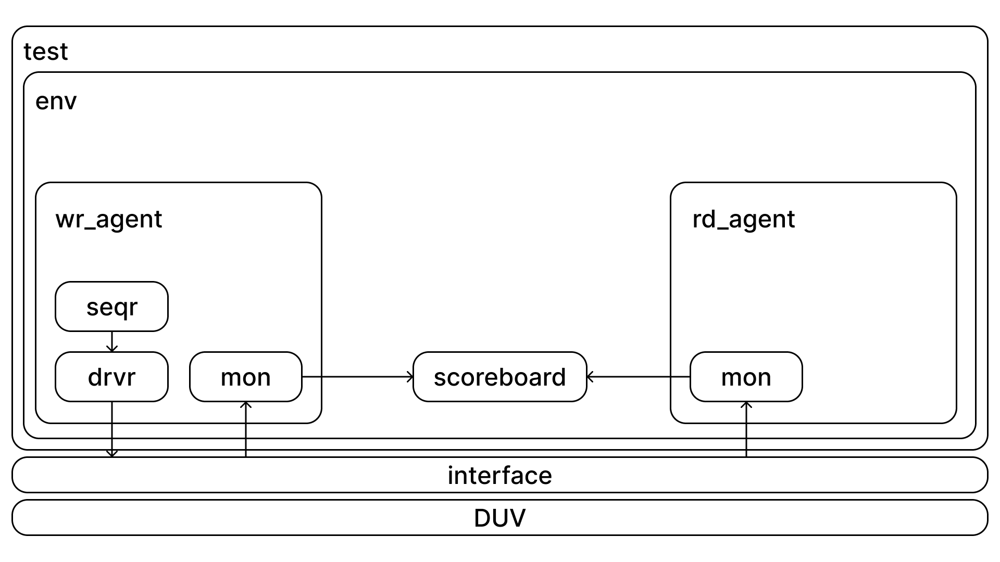
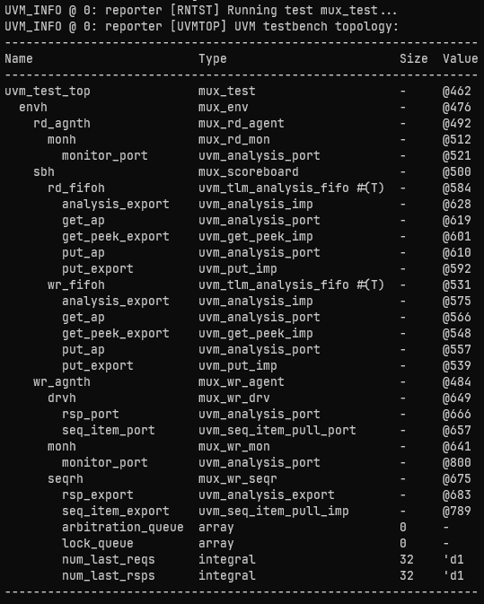

<h1>UVM Testbench for 8x1 Multiplexer</h1>

<h2>Overview</h2>
This is a simple testbench I've created for an 8x1 MUX RTL design.

<h2>About the design</h2>
The design choosen is a simple 8 to 1 Multiplexer. The RTL code can be viewed in the `rtl/` directory. The functionality of the RTL is that based on the 3 bit select signal one of the inputs gets routed into the output signal.

<h2>UVM Architecture</h2>

The architecture consists of two agents. The write agent is active as it needs to drive data into the DUV while the read agent is passive as it only needs to monitor outputs from the DUV.

## Results
After the testbench was printed the topology was printed to verify all the components were built properly. The obtained topology is shown below: 

 
 
